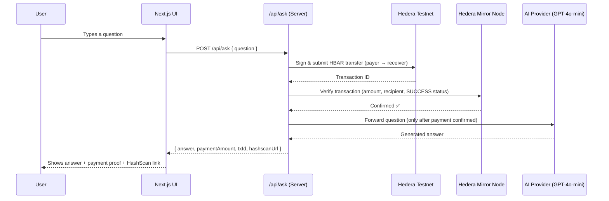

# ⚡ PayPerPrompt

**Pay-per-question AI, settled on Hedera.** No subscriptions. No API keys to manage. No credit card. Every answer costs a fraction of a cent, paid on-chain, verified before you get a response.

Built for the [Hedera x402 Hackathon](https://hedera.com) — implementing the HTTP `402 Payment Required` standard as a real, working payment protocol on Hedera testnet.

[](https://hedera.com)
[](https://github.com/coinbase/x402)
[](https://nextjs.org)
[](./LICENSE)

---

## 🎥 Demo

**[▶ Watch the demo video](#)** *(add your video link before submission)*

**Live transaction proof on HashScan:**
- [Transaction 1](https://hashscan.io/testnet/transaction/0.0.9567368-1784282269-498744589)
- [Transaction 2](https://hashscan.io/testnet/transaction/0.0.9567368-1784282302-241062366)

---

## 🧩 The Problem

AI APIs today force a binary choice: **subscribe monthly, or don't use it at all.**

That breaks down in a few real, common situations:

| Scenario | Why it fails today |
|---|---|
| **Occasional users** | Paying $20/month for 5 questions is a bad deal — most usage is wasted spend |
| **AI agents paying AI services** | Machine-to-machine commerce can't "enter a credit card" — traditional rails assume a human is present |
| **True micropayments** | Charging $0.01 through Stripe costs more in processing fees than the transaction itself |

Hedera's fixed, sub-cent transaction fees (~$0.0001–$0.001) make **genuine per-use pricing** viable for the first time — down to fractions of a cent, with no minimum spend and no invoicing.

## 💡 The Solution

**PayPerPrompt** gates every AI response behind a real, verified Hedera testnet payment using the **x402 standard** — the HTTP `402 Payment Required` status code, implemented as an actual working payment protocol instead of an unused corner of the HTTP spec.

Every question follows the same loop: **ask → get charged → pay on-chain → get verified → get answered.** No account. No subscription. No human in the payment loop.

---

## 🏗️ Architecture



### Payment verification detail

Payment isn't just "transaction submitted" — the server independently confirms it against Hedera's public Mirror Node before releasing any AI-generated content:

1. **Amount check** — the transfer meets or exceeds the required price
2. **Recipient check** — funds actually landed in the correct receiver account
3. **Status check** — the transaction result is `SUCCESS` on-chain
4. **Replay protection** — a transaction ID can only unlock one answer, ever

The payment gate can't be bypassed by forging a plausible-looking transaction ID — it's checked against Hedera's actual public ledger every time.

---

## 🛠️ Tech Stack

| Layer | Technology |
|---|---|
| Frontend | Next.js 14 (App Router), TypeScript, Tailwind CSS |
| Payments | Hedera testnet, `@hashgraph/sdk`, Hedera Mirror Node REST API |
| AI | GPT-4o-mini (OpenAI-compatible endpoint) |
| Protocol | x402 (HTTP 402 Payment Required) |

---

## 📁 Project Structure
pay-per-prompt/
├── app/
│   ├── api/ask/route.ts       # x402 payment gate + AI orchestration
│   ├── page.tsx                # Main layout
│   └── layout.tsx
├── components/
│   ├── ChatInterface.tsx       # Chat UI + status flow
│   ├── MessageBubble.tsx       # Question/answer bubbles + payment proof
│   ├── PaymentSidebar.tsx      # Session payment activity feed
│   └── PaymentTransactionItem.tsx
├── lib/
│   ├── hedera.ts                # Payment execution + Mirror Node verification
│   └── types.ts
└── .env                         # Hedera + AI provider config (not committed)
---

## 🚀 Getting Started

### Prerequisites

- Node.js 18+
- A Hedera testnet account ([get one free](https://portal.hedera.com)) — you'll need **two**: one to pay from, one to receive into
- An OpenAI-compatible API key (OpenAI, GitHub Models, or Groq)

### Setup

```bash
git clone https://github.com/KaushalGoud/pay-per-prompt.git
cd pay-per-prompt
npm install
```

Create `.env` in the project root:

```dotenv
# AI provider (OpenAI-compatible)
OPENAI_API_KEY=your_api_key
OPENAI_MODEL=gpt-4o-mini
OPENAI_BASE_URL=https://api.openai.com/v1

# Hedera testnet
HEDERA_ACCOUNT_ID=0.0.xxxxxxx        # payer account
HEDERA_PRIVATE_KEY=your_ecdsa_hex_key
RECEIVER_ACCOUNT_ID=0.0.xxxxxxx      # receiver account
PRICE_HBAR=0.1
MIRROR_NODE_URL=https://testnet.mirrornode.hedera.com
```

Run it:

```bash
npm run dev
```

Open [http://localhost:3000](http://localhost:3000), ask a question, watch a real HBAR payment happen, get your answer.

---

## 🔐 Security Notes

- `.env` is gitignored — never commit real private keys
- This demo uses a server-held payer key for simplicity; a production version would route payment authorization through the end user's own wallet (e.g. HashPack via HashConnect) rather than a server-side key
- Payment verification is always done server-side against the Mirror Node, never trusted from client input alone

---

## 🗺️ Roadmap

- [ ] User-side wallet connect (HashPack / HashConnect) instead of a server-held payer key
- [ ] Support USDC stablecoin payments alongside HBAR
- [ ] Per-model dynamic pricing (charge more for larger models)
- [ ] Public shared payment ledger view

---

## 🏆 Hedera x402 Hackathon Submission

- **Standard used:** x402 (HTTP 402 Payment Required)
- **Network:** Hedera Testnet
- **Reference architecture:** #1 — agent that pays per query
- **Real on-chain transactions:** ✅ (see HashScan links above)

---

## 👤 Author

**Kaushal Goud** — [GitHub](https://github.com/KaushalGoud)

## 📄 License

MIT