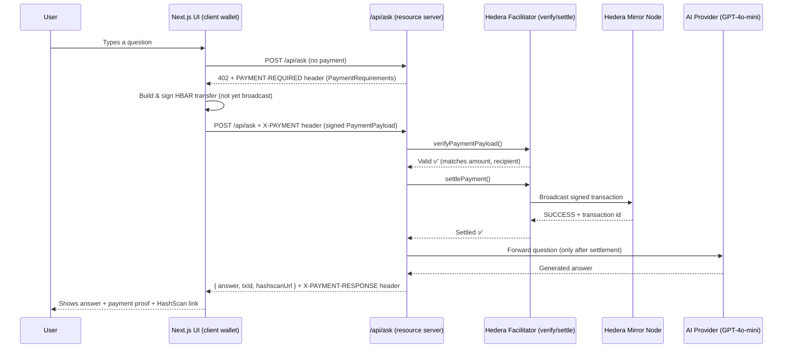

# ⚡ PayPerPrompt

**Pay-per-question AI, settled on Hedera — implementing the real x402 protocol.** No subscriptions. No stored API keys. No credit card. Every answer is unlocked by a client-signed, on-chain HBAR payment, verified and settled by the server before you get a response.

Built for the [Hedera x402 Hackathon](https://hedera.com) — this implements the actual [x402 specification](https://github.com/coinbase/x402) message formats and verify/settle flow, not just the HTTP 402 status code in isolation.

[](https://hedera.com)
[](https://github.com/coinbase/x402)
[](https://nextjs.org)
[](./LICENSE)


## 🧩 The Problem

AI APIs today force a binary choice: **subscribe monthly, or don't use it at all.**

That breaks down in a few real, common situations:

| Scenario | Why it fails today |
|---|---|
| **Occasional users** | Paying $20/month for 5 questions is a bad deal — most usage is wasted spend |
| **AI agents paying AI services** | Machine-to-machine commerce can't "enter a credit card" — traditional rails assume a human is present |
| **True micropayments** | Charging $0.01 through Stripe costs more in processing fees than the transaction itself |

Hedera's fixed, sub-cent transaction fees (~$0.0001–$0.001) make **genuine per-use pricing** viable for the first time — down to fractions of a cent, with no minimum spend and no invoicing.

## 💡 The Solution

**PayPerPrompt** implements the **x402 protocol** — an emerging open standard that activates HTTP's long-dormant `402 Payment Required` status code into a real, working payment flow — adapted to Hedera as a payment network.

Unlike a simplified "pay first, send a receipt" approach, this project follows the actual x402 message flow:

1. Client requests a resource with no payment attached
2. Server responds `402 Payment Required` with a `PAYMENT-REQUIRED` header describing exactly what payment it will accept (`PaymentRequirements`: scheme, network, asset, amount, recipient)
3. Client constructs and **signs** a matching Hedera transaction — without broadcasting it — and sends it back as an `X-PAYMENT` header (`PaymentPayload`)
4. Server **verifies** the payload matches the requirements (correct recipient, correct amount, well-formed transaction) without touching the chain yet
5. Server **settles** the payment by broadcasting the already-signed transaction to Hedera
6. Only after settlement succeeds does the server generate and return the AI answer, along with a `X-PAYMENT-RESPONSE` header carrying the settlement proof

This mirrors exactly how production x402 facilitators work on other chains — verify, then settle, as two distinct steps — just implemented for Hedera, which has no public facilitator today.

---

## 🏗️ Architecture



### Why verify/settle as two separate steps matters

Splitting verification from settlement means a malformed or underpaying request is rejected **before** any blockchain broadcast is attempted — cheaper, faster, and matches how real x402 facilitators are built. It also means the resource server (`/api/ask`) never needs to hold a payer's private key: it only ever inspects and relays a transaction the client already signed.

### Payment integrity checks

- **Recipient check** — the signed transaction's recipient must match the server's required `payTo` account
- **Amount check** — the transferred amount must meet or exceed `maxAmountRequired`
- **Structural check** — the payload must decode into a valid, well-formed Hedera `TransferTransaction`
- **Replay protection** — a settled transaction id can never be reused to unlock a second answer
- **On-chain confirmation** — settlement isn't considered successful until Hedera's own consensus returns a `SUCCESS` receipt

---

## 🛠️ Tech Stack

| Layer | Technology |
|---|---|
| Frontend | Next.js 14 (App Router), TypeScript, Tailwind CSS |
| Payments | Hedera testnet, `@hashgraph/sdk`, Hedera Mirror Node REST API |
| Protocol | x402 (`PaymentRequirements` / `PaymentPayload` / verify+settle, adapted for Hedera) |
| AI | GPT-4o-mini (OpenAI-compatible endpoint) |

---

## 📁 Project Structure

```
pay-per-prompt/
├── app/
│   ├── api/ask/route.ts          # x402 resource server: challenge, verify, settle, AI call
│   ├── page.tsx                    # Main layout
│   └── layout.tsx
├── components/
│   ├── ChatInterface.tsx           # Chat UI + real x402 request/sign/retry flow
│   ├── MessageBubble.tsx           # Question/answer bubbles + payment proof
│   ├── PaymentSidebar.tsx          # Session payment activity feed
│   └── PaymentTransactionItem.tsx
├── lib/
│   ├── x402.ts                       # x402 protocol types + header encode/decode
│   ├── hedera-facilitator.ts         # verifyPaymentPayload() + settlePayment()
│   ├── client-wallet.ts              # Browser-side transaction signing (demo wallet)
│   └── types.ts
└── .env                             # Hedera + AI provider config (not committed)
```

---

## 🚀 Getting Started

### Prerequisites

- Node.js 18+
- Two Hedera testnet accounts ([get one free](https://portal.hedera.com)):
  - a **client/payer** account (signs payments — stands in for a real wallet)
  - a **receiver** account (your platform's revenue account)
- An OpenAI-compatible API key (OpenAI, GitHub Models, or Groq)

### Setup

```bash
git clone https://github.com/KaushalGoud/payperprompt.git
cd payperprompt
npm install
```

Create `.env` in the project root:

```dotenv
# AI provider (OpenAI-compatible)
OPENAI_API_KEY=your_api_key
OPENAI_MODEL=gpt-4o-mini
OPENAI_BASE_URL=https://api.openai.com/v1

# Hedera testnet — receiver ("platform") account
RECEIVER_ACCOUNT_ID=0.0.xxxxxxx
PRICE_HBAR=0.1
MIRROR_NODE_URL=https://testnet.mirrornode.hedera.com

# Hedera testnet — client/payer demo wallet (browser-side signing)
# NOTE: NEXT_PUBLIC_ vars are bundled into the browser — testnet-only, never mainnet.
NEXT_PUBLIC_HEDERA_CLIENT_ACCOUNT_ID=0.0.xxxxxxx
NEXT_PUBLIC_HEDERA_CLIENT_PRIVATE_KEY=your_ecdsa_hex_key
```

Run it:

```bash
npm run dev
```

Open [http://localhost:3000](http://localhost:3000), ask a question, and watch the real x402 flow: 402 challenge → client signs → server verifies → server settles on-chain → answer appears with a HashScan link.

---

## 🔐 Security Notes

- `.env` is gitignored — never commit real private keys
- **The client-side signing key is intentionally a demo stand-in.** Because it's exposed via `NEXT_PUBLIC_`, it's visible in the browser bundle — acceptable only because it's a testnet account with no real value. A production version would replace `lib/client-wallet.ts` with a real wallet integration (e.g. HashPack via HashConnect), so the private key never leaves the user's own wallet software.
- The resource server (`/api/ask`) **never holds a payer's private key** — it only verifies and settles transactions the client has already signed, matching how real x402 facilitators operate.
- Payment verification and settlement are always performed server-side against Hedera directly — never trusted from client-supplied claims alone.

---

## 🗺️ Roadmap

- [ ] Replace the demo client wallet with real HashPack / HashConnect wallet integration
- [ ] Support USDC stablecoin payments alongside HBAR
- [ ] Publish a standalone, reusable Hedera x402 facilitator package (none exist publicly today)
- [ ] Per-model dynamic pricing (charge more for larger models)
- [ ] Public shared payment ledger view

---

## 🏆 Hedera x402 Hackathon Submission

- **Standard used:** x402 — full `PaymentRequirements` / `PaymentPayload` / verify+settle implementation, not just the bare 402 status code
- **Network:** Hedera Testnet
- **Reference architecture:** #1 — an agent that pays per query
- **Novel contribution:** a working x402 facilitator pattern for Hedera, a network with no public facilitator today
- **Real on-chain transactions:** ✅ (see HashScan links above)

---


